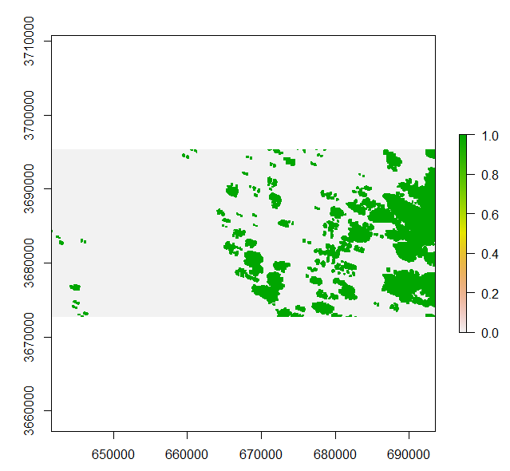
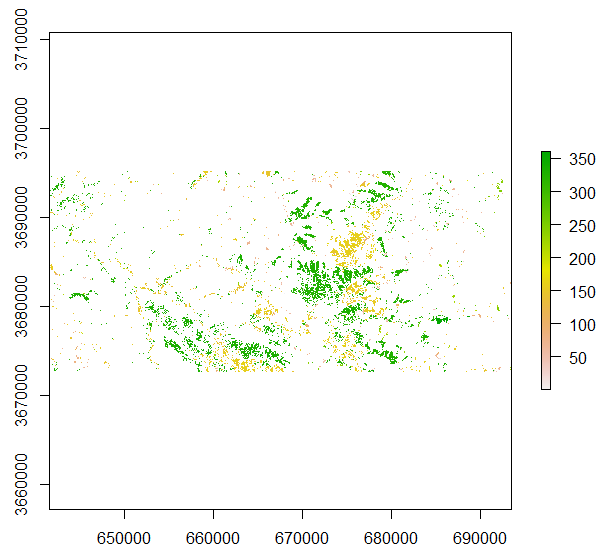

## Change-Vector-Analysis using Landsat data ##

### Overview ###

In this lecture you will learn how to perform a change-vector-analysis (CVA) using two Landsat images of a grassland area on the Eastern Tibetan Plateau.

The learned processing steps include:

- Loading Landsat data and corresponding cloud-mask images
- Calculate two vegetation indices serving as input to the CVA
- Calculate the CVA
- Post-process the CVA results 

## Change vector analysis ##

### Datasets used in this Tutorial ###

The datasets applied in this tutorial are available here:

[https://drive.google.com/open?id=1sN39_x_vUePdQNtWTRIQioU1qK11jcAQ](https://drive.google.com/open?id=1sN39_x_vUePdQNtWTRIQioU1qK11jcAQ)

The zip-file contains two Landsat images from 2004 and 2014 and the corresponding cloud masks.

### Step 1: Loading packages and Landsat data  ###

As first step, load all necessary R packages by executing the following code (please install missing packages):

	require(raster)
	require(RStoolbox)
	

Next, we will load the Landsat images using the steps you already know from the proceeding Tutorials. 

	setwd("D:/Remote_Sensing/1_Fernerkundung/change_vector_analysis")

	# load cloud images
	cl_04 <- stack("cl_img14_clipped.tif")
	cl_14<- stack("cl_img04_clipped.tif")

	#load Landsat images
	ls_04 <- stack("LS5Jul2004_clipped.tif")
	ls_14 <- stack("LS8Jul14_clipped.tif")

If you want, you can have a quick look at the images using a standard or a RGB plot:

	plot(cl_04)
	plotRGB(ls_04, r=3,g=2,b=1, stretch="hist")

Which will result in the following plots:

Feel free to also plot the second Landsat image and the corresponding cloud-mask. In case you are getting an error with respect to the margins in RStudio, try to use the **x11()**-command before plotting.

### Step 2: Calculate Vegetation Indices in preparation for the CVA  ###

Next we will calculate two vegetation indices from the Landsat images. We will use the **Enhanced** **Vegetation** **Index** (EVI), a vegetation index similar to the NDVI but with some improved properties concerning the exclusion of background/soil influences. And as second index, we will use the **Urban** **Index**, an index that accentuates the differences between bare soil and urban areas.

To calculate the EVI we, we first have to scale the Landsat images. The two images are currently stored as integer-datasets with values between 0 and 10000 (=100% Reflectance). To calculate the EVI, we need them to be scaled between 0 and 1. Hence we run:

	ls_04 <- ls_04 * 0.0001
	ls_14 <- ls_14 * 0.0001

Then we apply the Landsat-specific EVI formula which for example can be found here:

[https://landsat.usgs.gov/sites/default/files/documents/si_product_guide.pdf](https://landsat.usgs.gov/sites/default/files/documents/si_product_guide.pdf)

Be aware that the bands would normally vary for the two images as the 2004 image was recorded by Landsat 5 and the 2014 image by Landsat 8. You should already know that these two sensors have differing spectral bands.In this case, however, the two Landsat images were reduced to the same six spectral bands. Hence, the same formula is applied to calculate the EVI images.

	EVI_04 <- 2.5*((ls_04[[4]]-ls_04[[3]])/(ls_04[[4]]+6 * ls_04[[3]]- 7.5 * ls_04[[1]] + 1))
	EVI_14 <- 2.5*((ls_14[[4]]-ls_14[[3]])/(ls_14[[4]]+6 * ls_14[[3]]- 7.5 * ls_14[[1]] + 1))

We can have a quick look on the resulting index images by plotting the two files:

	plot(EVI_04, zlim=c(-1,1))
	plot(EVI_14, zlim=c(-1,1))

Which will result in the following two plots:

As second input index for the CVA, we will now calculate the Urban Index as follows:

	UI_04 <- (ls_04[[6]]-ls_04[[4]])/(ls_04[[6]]+ls_04[[4]])
	UI_14 <- (ls_14[[6]]-ls_14[[4]])/(ls_14[[6]]+ls_14[[4]])

If you want, you can plot the two UI-images as well.

### Step 3: Prepare and run the CVA  ###

To run the CVA, the two vegetation indices of a single time step have to be stacked into an individual Image. To accomplish this, we run:

	time1 <- stack(EVI_04, UI_04)
	time2 <- stack(EVI_14, UI_14)

Then we are ready to execute the CVA by running:

	cva <- rasterCVA(time1, time2, tmf=2)

The additional parameter tmf is defined in the help-function of the **cva**-function as: "tmf = threshold median factor. Used to calculate a threshold magnitude for which pixels are considered stable, i.e. no change. Defaults to 2 times the median non-zero magnitude. Calculated as tmf * median(magnitude[magnitude > 0])"

If we now plot the results of the **rasterCVA**-function, we can see that there are two outputs: the change angle and the change magnitude. Be also aware that there are many areas showing a change angle and a change magnitude of zero. These are the areas that were already masked out as no-change areas based on the tmf-value. You can change the tmf-value and re-run the cva to check how this affects the results.

	plot(cva)

We can now save these results to individual raster files:

	setwd("D:/Remote_Sensing/1_Fernerkundung/change_vector_analysis/output")

	writeRaster(cva[[1]], filename="change_angle_04_14.tif", format="GTiff")
	writeRaster(cva[[2]], filename="change_magnitude_04_14.tif", format="GTiff")

### Step 4: Post-processing the CVA results  ###

After creating the raw-results, we can now apply some post-processing to get more detailed information about the changes that were occurring in the studied area between 2000 and 2014.

As first step, we will try to differentiate between real changes and smaller fluctuations as well as changes related to cloud-cover.

To get rid of smaller changes that could also relate to phenology differences or natural fluctuations in the vegetation signal, we will apply a threshold value to the magnitude image:

	# copy the magnitude image into an own variable
	magn <- cva[[2]]
	# then create a mask (threshold set to 0.2)
	magn_mask <- magn > 0.2
	# apply the mask to the magnitude image
	magn_masked <- mask(magn, magn_mask, maskvalue=0)

This results in a new magnitude image in which only areas with a change magnitude greater than 0.2 remained. We can plot this result by running:

	plot(magn_masked, zlim=c(0,2))

As next step, we will mask out all areas that were affected by clouds and are hence likely to point-out changes in areas where we actually cannot make any reliable statements. To mask out the cloud-affected areas we merge the two cloud-mask images for the 2004 and 2014 image.

We accomplish this by running:

	clouds <- (cl_04+cl_14) > 0

This line of code will sum the binary cloud masks (pixel = 1 indicates cloud, pixel = 0 indicated clear pixel) from 2004 and 2014 and all pixels with a sum of greater than zero (that is pixels that were covered by clouds at least once) will be set to 1 and all other values to 0.

We can have a look at the cloud-mask by running:

	plot(clouds)

We now first save the cloud-mask to the harddisc and then apply it to the magnitude image:

	# write cloud-mask to harddisc
	writeRaster(magn_final, filename="magnitude_final_04_14.tif", format="GTiff")

We can then apply the cloud mask to our magnitude image by running:

	magn_final <- mask(magn_masked, clouds, maskvalue=1)

In some cases an error may occur stating that the extent of the two raster datasets does not match. In this case we can apply the following work-around:

	# work around (clouds-image is for some reason one pixel too small -> extent dont match)
	clouds2 <- crop(clouds, magn_masked)
	# mask magnitude image with clouds
	magn_final <- mask(magn_masked, clouds2, maskvalue=1)

By first cropping the cloud-mask with the magnitude image, we ensure that the two images have the same size. Then we re-run the code we already tried and which has resulted in the error concerning the extents. This should result in the final magnitude image with all low-intensity changes and changes caused by clouds masked out:
	
	# plot the final magnitude image
	plot(magn_final)
	# write raster to file
	writeRaster(magn_final, filename="magnitude_final_uncut_04_14.tif", format="GTiff")

	

We can now use the final magnitude image to also mask the change direction image as we are only interested in the change angles of those pixel that also also showed a valid change magnitude (largen enough and not influenced by clouds). To do this, we run the following lines:

	# copy the change angle raster into an own variable
	vec <- cva[[1]]
	# create a magnitude mask by selecting all pixels with a change magnitude greater than 0 (0 values were the areas masked out in the preceeding steps)
	vec_mask <- magn_final > 0
	# then apply the magnitude mask to the change angle image
	vec_final <- mask(vec, vec_mask. maskvalue=NA)

As last steps, we have a look at the results and save the final change-vector image to the harddisc:

	plot(vec_final)
	writeRaster(vec_final, filename="vector_final_04_14.tif", format="GTiff")

	

	
**Exercise:** Based on the above-shown image we can see that the change angle image seems to point-out mostly two different change directions. One at around 360° and another at around 180°. Based on what you have learned about the change-vector-analysis in today's lecture, try to explain what these two classes are. You can also load the two change-datasets (change angle and change magnitude), along with the Landsat data in QGIS and have a look at what has changed at the given locations. This will also help you to figure out what the two classes represent.

Furthermore, try to build two separate images each showing only one of the two classes. Only use R commands to do this. You should already know how to accomplish this by now.

	